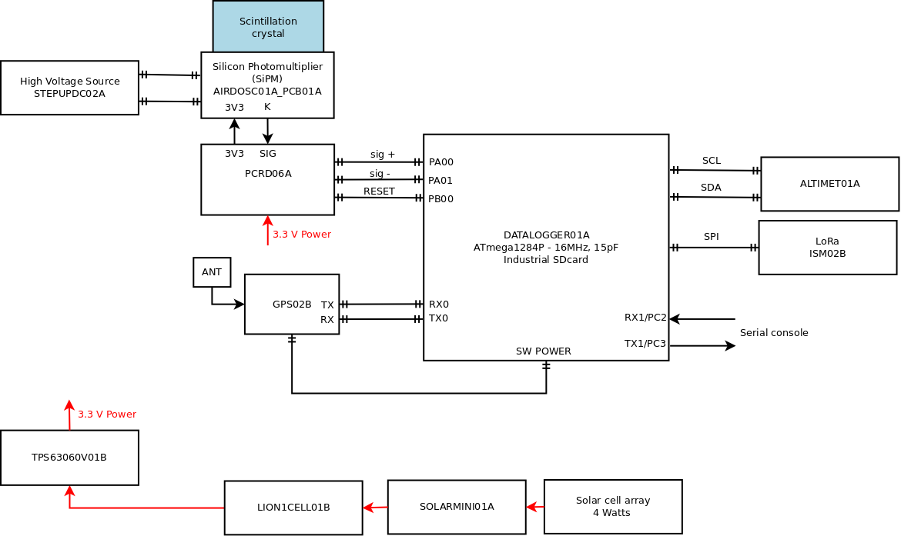

# GEODOS01A - stationary ionizing radiation monitor

*Open-source scintillation detector of ionizing radiation. The device can be further modified according to specific requirements. Character of its construction makes it especially suitable for placement into mountaints to in-field measurement*

### Locations

#### Chernobyl Red Forest

One GEODOS device is installed in [Chernobyl Red Forest site](https://en.wikipedia.org/wiki/Red_Forest).

#### Chernobyl Red Forest

One GEODOS device is installed on [Polednik watch tower](https://cs.wikipedia.org/wiki/Poledn%C3%ADk_(%C5%A0umava)).

### Technical parameters

* Detection element: scintillation crystal NaI(Tl) 10 mm diameter 20 mm length integrated with SiPM detector
* Power source: solar panel
* Backup power source: rechargable 18650 Li-ion cell
* Data memory: SD card
* Record’s content: energy and time of each event
* Record’s periodicity: 10 s (maximal dead time 2 s)
* Time resolution: 20 us
* Accuracy of event’s time: 500 ns
* Energy range: 0.3 to 1 MeV (0,2 MeV resolution)
* Open-source HW and SW
* Device status indicator type LED
* Uniterrupted measurement interval 365 days minimum
* LoRa connection to IoT network
* Weather resistivity IP 65

### Device block diagram

### Sensor element

The core of the detector  - scintillation crystal with [SiPM detector](https://en.wikipedia.org/wiki/Silicon_photomultiplier).

### Data storage

The primary raw data are stored in SDcard memory. The IoT network is used to telemetry data transfer, for device monitoring (e.g. Temperature, Humidity, Pressure, Battery voltage etc.).  We using normally the [TTN](https://www.thethingsnetwork.org/), but the device could be configured for use any IoT LoRa based network.
For remote areas, mounting a IoT gateway in radio range of GEODOS instruments could be also a good option.

### Detailed documentation of used electronic modules

* [STEPUPDC02A](https://github.com/mlab-modules/STEPUPDC02)
* [AIRDOSC01A_PCB01C](https://github.com/UniversalScientificTechnologies/AIRDOSC01/tree/AIRDOSC01A/hw/sch_pcb/AIRDOSC01A_PCB01C)
* [PCRD06A](https://github.com/mlab-modules/PCRD06)
* [GPS01B](https://www.mlab.cz/module/GPS01B)
* [DATALOGGER01A](http://mlab.cz/module/DATALOGGER01A)
* [ALTIMET01A](https://github.com/mlab-modules/ALTIMET01)
* [ISM02B](https://github.com/mlab-modules/ISM02)
* [TPS63060V01A](https://github.com/mlab-modules/TPS63060V01)
* [LION1CELL01B](https://github.com/mlab-modules/LION1CELL01)
* [SOLARMINI01A](https://github.com/mlab-modules/SOLARMINI01)
